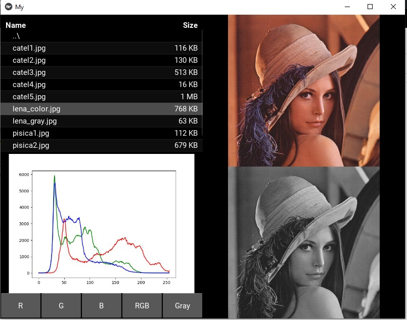
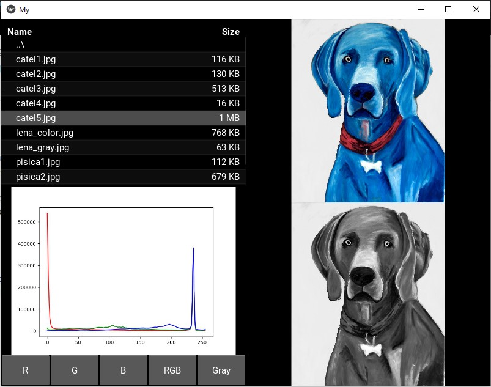

# KivyGUI-Image-Histogram
Graphical user interface using Kivy library for image conversion with gray levels and histogram display.

## Screenshots
<p float="left">
  
   
  
</p>

## Prerequisites
- Python 3.7
- Kivy 1.11

## Installation 
**For Anaconda Environment in Windows OS**
To install the Kivy library, open the Command Prompt from Anaconda and execute the command: 
```
conda install kivy -c conda-forge
```
If you run KivyGUI-App.py in **Spyder IDE**, you will need to select the "Execute in an external system terminal" option from the "Run configuration per file" menu.

**Linux OS**
``` 
sudo apt install python3-kivy
git clone https://github.com/radualexandrub/KivyGUI-Image-Histogram.git KivyApp
cd KivyApp
python3 KivyGUI-App.py
```
