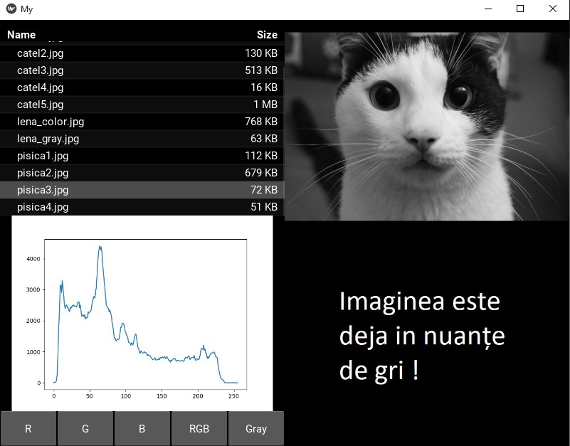

# KivyGUI-Image-Histogram
Graphical user interface using Kivy library for image conversion with gray levels and histogram display.

## Screenshots
<p float="left">
  
   
  
</p>

## Prerequisites
- Python 3.7
- Kivy 1.11

## Installation 
**For Anaconda Environment in Windows OS**

To install the Kivy library, open the Command Prompt from Anaconda and execute the command: 
```
conda install kivy -c conda-forge
```
If you run KivyGUI-App.py in **Spyder IDE**, you will need to select the "Execute in an external system terminal" option from the "Run configuration per file" menu.

**Linux OS**
``` 
sudo apt install python3-kivy
git clone https://github.com/radualexandrub/KivyGUI-Image-Histogram.git KivyApp
cd KivyApp
python3 KivyGUI-App.py
```
## Application description
The application consists of a single main window, which contains 5 elements:
- The "File Chooser" browser from which the images can be selected
- An image space (upper right corner) where the selected image will be displayed, respectively the gray level image (lower right corner)
- An image space where the histogram of the selected image will be displayed
- 5 buttons for displaying each color channel in the histogram, respectively the simultaneous display of the 3 channels or the histogram display for the image converted to gray levels.


Optional in Command Prompt (Windows):
- check conda environments:
```
conda env list
```
- check which packages are installed in the current conda environment:
```
conda list
```
